<picture>
  <source media="(prefers-color-scheme: dark)" srcset="header.svg">
  <source media="(prefers-color-scheme: light)" srcset="header.svg">
  
</picture>

 

Seventeen, based in northern Germany. Most people pick a lane — I keep finding ways to cross them.

Some days I'm debugging gene expression pipelines. Other days I'm obsessing over the exact `border-radius` that makes a button feel like a Braun calculator. Occasionally both happen before lunch.

I think the best interfaces borrow from biology. The best research benefits from good taste. And the best code is written by someone who's read something other than documentation.

 

 

<picture>
  <source media="(prefers-color-scheme: dark)" srcset="projects.svg">
  <source media="(prefers-color-scheme: light)" srcset="projects.svg">
  
</picture>

[`prometheusX`](https://github.com/Jah-yee/prometheusX)&nbsp;&nbsp;&nbsp;·&nbsp;&nbsp;&nbsp;[`rams-design-system`](https://github.com/Jah-yee/rams-design-system)&nbsp;&nbsp;&nbsp;·&nbsp;&nbsp;&nbsp;[`sparklab`](https://github.com/Jah-yee/sparklab)&nbsp;&nbsp;&nbsp;·&nbsp;&nbsp;&nbsp;[`mydna`](https://github.com/Jah-yee/mydna)&nbsp;&nbsp;&nbsp;·&nbsp;&nbsp;&nbsp;[`eyeOS`](https://github.com/Jah-yee/eyeos)&nbsp;&nbsp;&nbsp;·&nbsp;&nbsp;&nbsp;[`creative-lab`](https://github.com/Jah-yee/creative-lab)

 

 

<picture>
  <source media="(prefers-color-scheme: dark)" srcset="stack.svg">
  <source media="(prefers-color-scheme: light)" srcset="stack.svg">
  
</picture>

 

 

<picture>
  <source media="(prefers-color-scheme: dark)" srcset="https://github-readme-stats.vercel.app/api?username=Jah-yee&show_icons=true&bg_color=222120&title_color=8fa06a&text_color=8b9389&icon_color=ff6b35&border_color=333130&include_all_commits=true&hide_border=false&border_radius=20">
  <source media="(prefers-color-scheme: light)" srcset="https://github-readme-stats.vercel.app/api?username=Jah-yee&show_icons=true&bg_color=eae7df&title_color=2d3a20&text_color=5a5550&icon_color=ff6b35&border_color=dcd7cd&include_all_commits=true&hide_border=false&border_radius=20">
  
</picture>
&nbsp;
<picture>
  <source media="(prefers-color-scheme: dark)" srcset="https://github-readme-stats.vercel.app/api/top-langs/?username=Jah-yee&layout=compact&bg_color=222120&title_color=8fa06a&text_color=8b9389&border_color=333130&langs_count=6&hide_border=false&border_radius=20">
  <source media="(prefers-color-scheme: light)" srcset="https://github-readme-stats.vercel.app/api/top-langs/?username=Jah-yee&layout=compact&bg_color=eae7df&title_color=2d3a20&text_color=5a5550&border_color=dcd7cd&langs_count=6&hide_border=false&border_radius=20">
  
</picture>

  

<picture>
  <source media="(prefers-color-scheme: dark)" srcset="https://streak-stats.demolab.com?user=Jah-yee&background=222120&border=333130&ring=ff6b35&fire=ff6b35&currStreakLabel=8fa06a&sideLabels=8b9389&dates=5a5550&currStreakNum=8fa06a&sideNums=8fa06a&border_radius=20">
  <source media="(prefers-color-scheme: light)" srcset="https://streak-stats.demolab.com?user=Jah-yee&background=eae7df&border=dcd7cd&ring=ff6b35&fire=ff6b35&currStreakLabel=2d3a20&sideLabels=5a5550&dates=c4bdb1&currStreakNum=2d3a20&sideNums=2d3a20&border_radius=20">
  
</picture>

 

 

<picture>
  <source media="(prefers-color-scheme: dark)" srcset="connect.svg">
  <source media="(prefers-color-scheme: light)" srcset="connect.svg">
  
</picture>

&nbsp;&nbsp;&nbsp;&nbsp;&nbsp;&nbsp;

 

*I don't specialize. I connect.*

 

